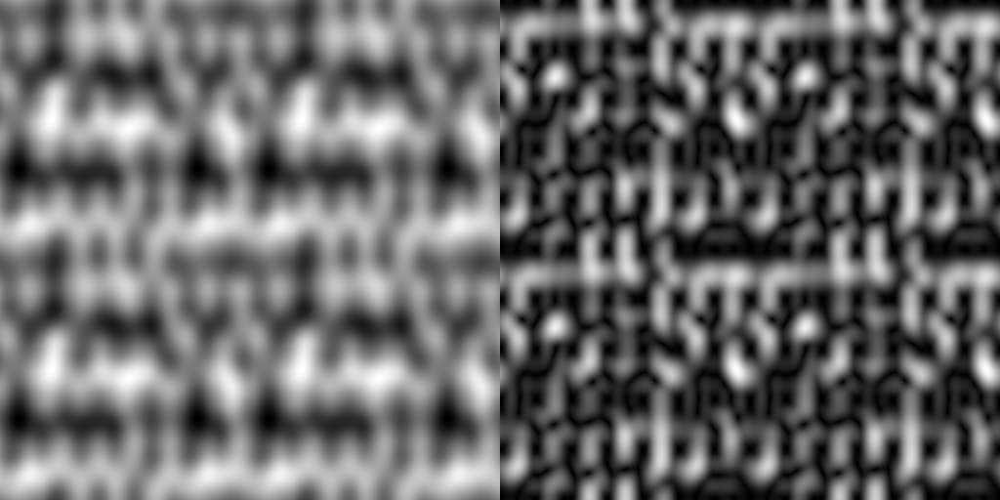
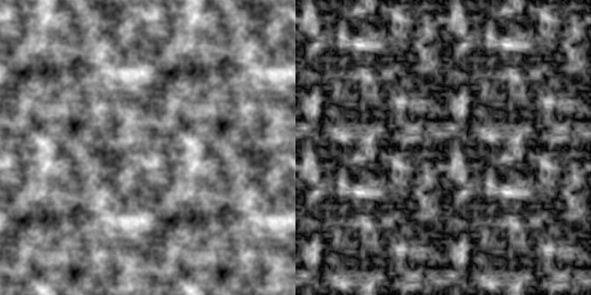
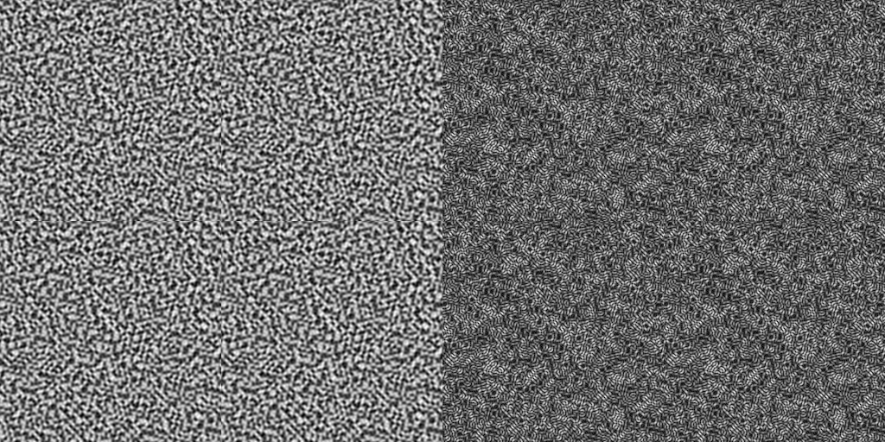
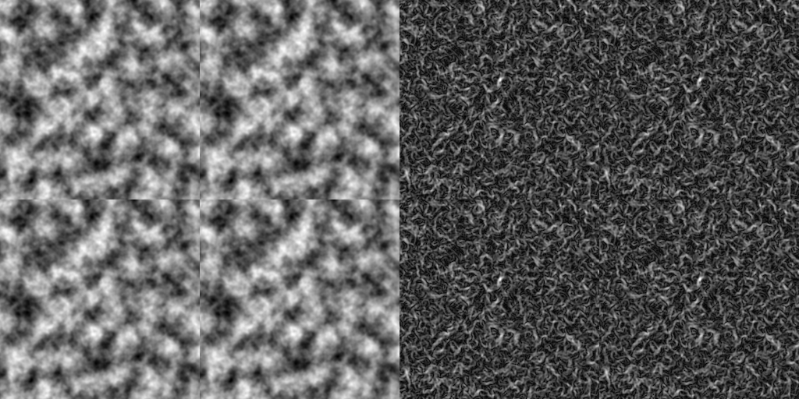
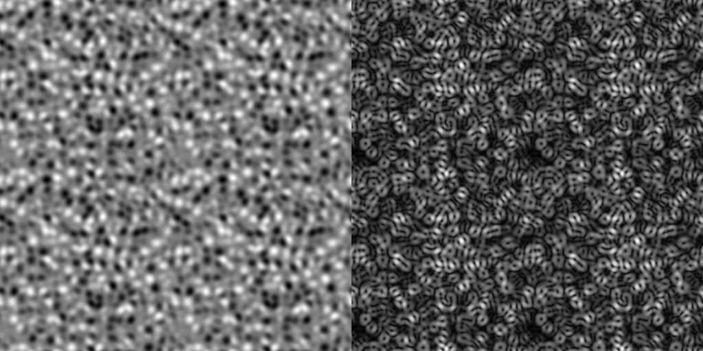
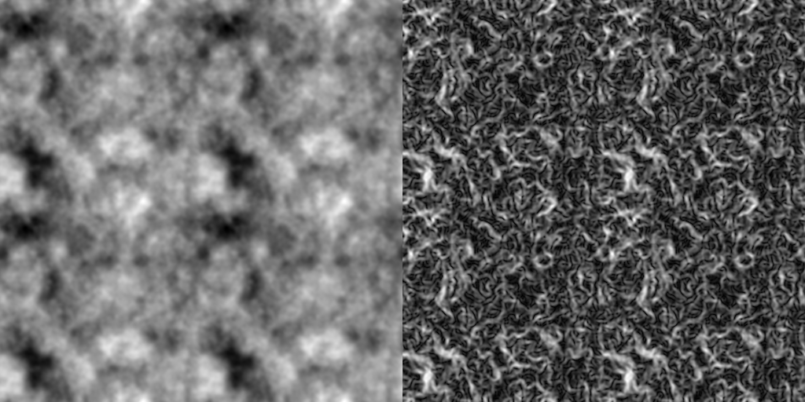
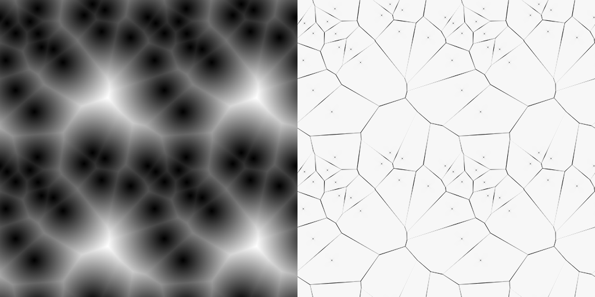
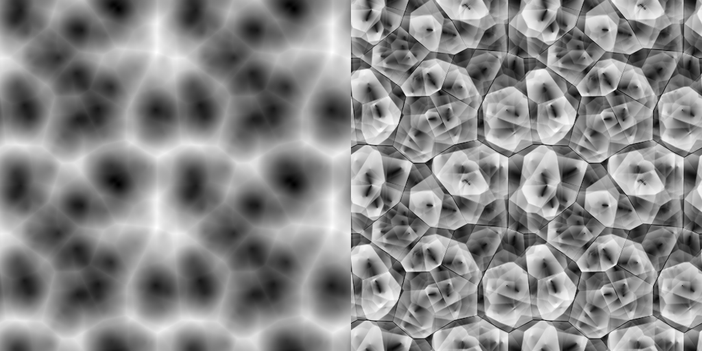

# noise

2D Noise generation utilities

## Usage

This crate provides a simple API for creating `Noise` objects which can be sampled within the unit square for both their value and analytical gradient.

```rust
let mut rng = thread_rng();

let noise = Perlin::new(SHAPE, &mut rng);

let value = noise.sample([0.25, 0.75]);
let gradient = noise.gradient([0.25, 0.75]);
```

### Stacks

You can stack multiple weighted noise functions together into a single noise function using the `Stack` struct:

```rust
let noise = Stack::new(vec![
    (Box::new(Perlin::new((5, 5), &mut rng)), 1.0),
    (Box::new(Perlin::new((7, 7), &mut rng)), 0.5),
    (Box::new(Perlin::new((11, 11), &mut rng)), 0.25),
    (Box::new(Perlin::new((23, 23), &mut rng)), 0.125),
    (Box::new(Perlin::new((43, 43), &mut rng)), 0.0625),
]);
```

## Features

Left: Each of the images below show the sampled noise function over the unit square, tiled 2 times in each direction to show the periodicity of the noise.

Right: The magnitude of the gradient of the noise function scaled to the range [0, 1].

Top: A single noise function.

Bottom: A stack of multiple noise functions with different weights.

### Perlin Noise





### Simplex Noise





### OpenSimplex Noise





> Note: Simplex noise is inherently not tileable, however the OpenSimplex implementation is tileable (by using 4D space).

### Worley Noise





> Note: The gradient of the Worley noise can not be determined analytically, so the gradient is approximated using central differences.

## Examples

You can run the examples to generate images of the noise functions.

First, clone the repository and set the current directory to the root of the repository:

```sh
git clone https://github.com/FreddyWordingham/noise.git
cd noise
```

Make sure to create the `./output` directory for the images to be saved to:

```sh
mkdir ./output
```

Then, build the examples:

```sh
cargo build --release --examples
```

And run the example you want to generate an image.
For example, to generate an image of stacked Simplex noise:

```sh
cargo run --release --example open_simplex_stack
```
