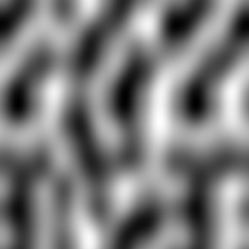
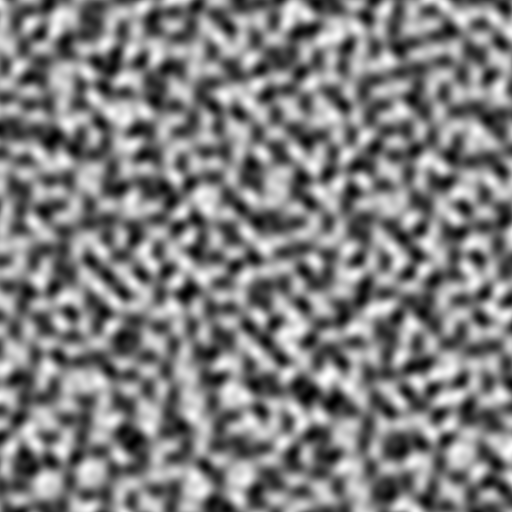
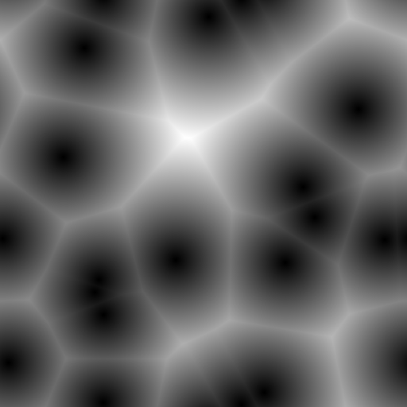
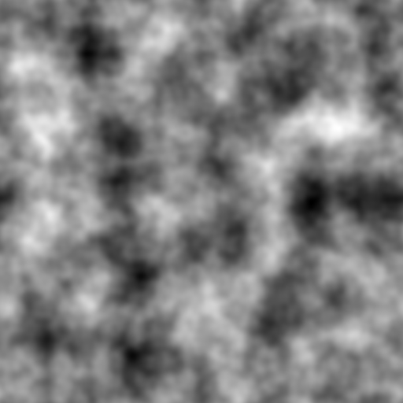
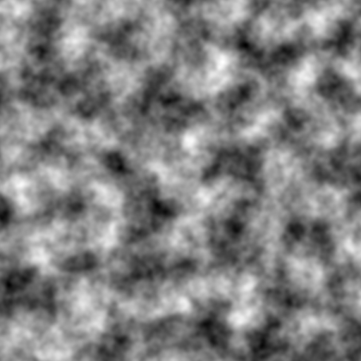

# noise

2D Noise generation utilities

## Usage

This crate provides a simple API for creating `Noise` objects which can be sampled within the unit square:

```rust
let mut rng = thread_rng();

let noise = Perlin::new(SHAPE, &mut rng);

let value = noise.sample([0.25, 0.75]);
```

## Features

### Perlin Noise



### Simplex Noise



### Worley Noise



### Stacks

You can stack multiple weighted noise functions together into a single noise function using the `Stack` struct:

```rust
let noise = Stack::new(vec![
    (Box::new(Perlin::new((5, 5), &mut rng)), 1.0),
    (Box::new(Perlin::new((7, 7), &mut rng)), 0.5),
    (Box::new(Perlin::new((11, 11), &mut rng)), 0.25),
    (Box::new(Perlin::new((23, 23), &mut rng)), 0.125),
    (Box::new(Perlin::new((43, 43), &mut rng)), 0.0625),
]);
```



> Stacked Perlin noise



> Stacked Simplex noise

## Tileable Noise

By default all noise types other than Simplex noise will repeatedly tile.
